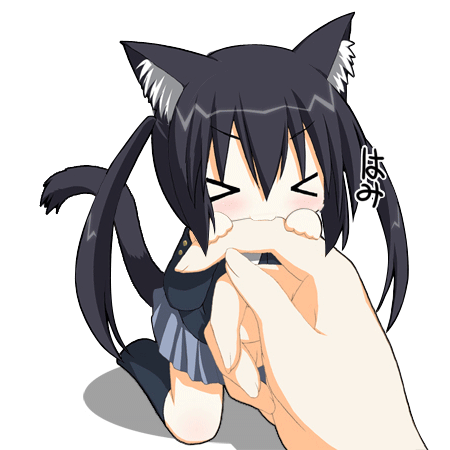

<!-- Bagian Profil -->

  

    - 👋 Hi, I’m @SiOzan 
    - 👀 I’m interested in how the world works 
    - 🌱 I’m currently learning to code (beginner) 
    - 💞️ I’m looking to collaborate on developer company 
    - 📫 How to reach me "just call me" 
    - 😄 Pronouns: PADEV 
    - ⚡ Fun fact: there are two of me, one with Vincent
  

  

---

<!-- Bagian Bahasa Pemrograman -->
<h2 align="center" style="animation: fadeIn 2s ease;">🐱 Language Skills 🐱</h2>

<!-- Animasi bergulir -->
<marquee behavior="alternate" direction="left" scrollamount="7">
  

  
  
  
  
  
  
  
  
  
  
  
  
  
  
  
  
  
  
  
  
  
  
  
  
  
  
  
  
  
  
  

</marquee>

<!-- Bagian GIF Animasi -->

  

---

<!-- Bagian Sosial Media - Bagian Atas -->

  
  <!-- Email -->
  

  <!-- Telegram -->
  

  <!-- Discord -->
  

<!-- Spacer -->
 

<!-- Bagian Sosial Media - Bagian Bawah -->

    <!-- Github -->
  
  
  <!-- Whatsapp -->
  
  
  <!-- Tiktok -->
  

  <!-- Instagram -->
  

  <!-- X (dulu Twitter) -->
  

